# همانگار | Hamangar

اپلیکیشن اندرویدی **همانگار** با هدف مدیریت ساده و کاربردی فروش، موجودی کالا، خدمات و گزارش‌های مالی کسب‌وکارهای کوچک توسعه داده شده است.

همانگار با استفاده از **Kotlin** و **Jetpack Compose** ساخته شده و معماری پروژه بر پایه **MVVM** و جداسازی لایه‌های **Data، Domain و Presentation** طراحی شده است.

---

## ✨ امکانات

### 🌐 خدمات اینترنتی

- ثبت خدمات انجام‌شده
- ثبت تعداد خدمات
- ثبت مبلغ و توضیحات
- نمایش خدمات ثبت‌شده
- محاسبه درآمد روزانه
- محاسبه درآمد ماهانه
- فیلتر اطلاعات بر اساس تاریخ
- انتخاب تاریخ برای مشاهده اطلاعات
- ویرایش خدمات ثبت‌شده
- حذف خدمات ثبت‌شده
- ذخیره اطلاعات در دیتابیس محلی

### 📦 مدیریت کالا و لوازم‌التحریر

- ثبت محصول
- ثبت نام کالا
- ثبت قیمت خرید
- ثبت قیمت فروش
- ثبت موجودی
- ثبت توضیحات
- ویرایش محصول
- حذف محصول
- نمایش لیست محصولات
- جستجوی محصول بر اساس نام
- نمایش محصولات دارای موجودی
- نمایش کالاهای دارای موجودی کم

### 🛒 ثبت فروش

- انتخاب محصول از لیست
- نمایش قیمت خرید و فروش
- نمایش موجودی فعلی
- ثبت تعداد فروش
- ثبت توضیحات
- جلوگیری از فروش بیشتر از موجودی
- کاهش خودکار موجودی پس از فروش
- نمایش فروش‌های ثبت‌شده
- محاسبه مبلغ فروش
- محاسبه سود
- حذف فروش
- بازگرداندن موجودی پس از حذف فروش
- ویرایش فروش
- اصلاح موجودی پس از ویرایش فروش

### 📊 گزارش فروش

- گزارش فروش امروز
- گزارش فروش ماه جاری
- مبلغ فروش روزانه
- مبلغ فروش ماهانه
- سود تقریبی روزانه
- سود تقریبی ماهانه
- تعداد کالاهای فروخته‌شده
- تعداد تراکنش‌های روزانه
- تعداد تراکنش‌های ماهانه

### ⚠️ موجودی کم

کالاهایی که موجودی آن‌ها ۵ عدد یا کمتر باشد در این بخش نمایش داده می‌شوند.

اطلاعات قابل مشاهده:

- نام کالا
- کد کالا
- موجودی فعلی
- قیمت فروش
- موجودی فعلی کالا

---

## 🌙 حالت روشن و تاریک

همانگار از هر دو حالت **Light Mode** و **Dark Mode** پشتیبانی می‌کند.

رابط کاربری با استفاده از `MaterialTheme` طراحی شده تا برنامه در حالت روشن و تاریک قابل استفاده باشد.

---

## 🧱 معماری

ساختار کلی پروژه:

    Presentation
          ↓
      ViewModel
          ↓
       UseCase
          ↓
     Repository
          ↓
         DAO
          ↓
    Room Database

### Presentation

مسئول رابط کاربری و تعامل با کاربر:

- Jetpack Compose
- Material 3
- ViewModel
- Navigation Compose
- State Management

### Domain

مسئول منطق اصلی برنامه:

- Domain Models
- Repository Interfaces
- UseCases

### Data

مسئول ذخیره‌سازی و دسترسی به داده:

- Room Entities
- DAO
- Repository Implementations
- Mappers

---

## 🗃️ مدل محصول

اطلاعات محصول شامل:

    id
    productName
    purchasePrice
    salesPrice
    stock
    description
    createdAt

---

## 🛒 مدل فروش

اطلاعات فروش شامل:

    id
    productId
    purchasePriceAsSale
    salePriceAsSale
    quantity
    date
    description
    createdAt

یکی از نکات مهم طراحی این پروژه این است که قیمت خرید و قیمت فروش در زمان ثبت فروش داخل رکورد فروش ذخیره می‌شوند.

بنابراین اگر قیمت محصول در آینده تغییر کند، اطلاعات فروش قبلی همچنان بر اساس قیمت زمان فروش قابل محاسبه خواهد بود.

---

## 💰 محاسبه سود

سود هر فروش بر اساس فرمول زیر محاسبه می‌شود:

    سود = (قیمت فروش - قیمت خرید) × تعداد

مثال:

    قیمت خرید = 50,000
    قیمت فروش = 70,000
    تعداد = 3

    سود = (70,000 - 50,000) × 3
    سود = 60,000

---

## 📦 مدیریت موجودی

هنگام ثبت فروش:

    موجودی جدید = موجودی فعلی - تعداد فروش

هنگام حذف فروش:

    موجودی جدید = موجودی فعلی + تعداد فروش

هنگام ویرایش فروش نیز موجودی بر اساس تعداد قبلی و تعداد جدید اصلاح می‌شود.

---

## 🔎 جستجوی محصول

جستجوی محصولات بر اساس نام در DAO پیاده‌سازی شده است.

    SELECT * FROM table_product
    WHERE product_name LIKE '%' || :productName || '%'

---

## 📅 گزارش‌های زمانی

فروش‌ها با تاریخ ثبت می‌شوند.

فرمت تاریخ:

    yyyy/MM/dd

برای گزارش ماهانه از فرمت:

    yyyy/MM

استفاده می‌شود.

---

## 🛠️ تکنولوژی‌ها

- Kotlin
- Jetpack Compose
- Material 3
- Room Database
- Kotlin Coroutines
- Kotlin Flow
- Dagger Hilt
- Navigation Compose
- MVVM
- Clean Architecture
- Repository Pattern

---

## 💉 Dependency Injection

برای مدیریت وابستگی‌ها از **Dagger Hilt** استفاده شده است.

ساختار وابستگی:

    ViewModel
         ↓
      UseCase
         ↓
    Repository Interface
         ↓
      RepositoryImpl
         ↓
         DAO

---

## 🗂️ ساختار کلی پروژه

    com.example.myapplication
    │
    ├── data
    │   ├── local
    │   │   ├── dao
    │   │   └── entity
    │   ├── mapper
    │   └── repository
    │
    ├── domain
    │   ├── model
    │   ├── repository
    │   └── useCase
    │
    └── presentation
        ├── screen
        ├── viewModel
        └── ui

---

## 🧭 بخش‌های اصلی برنامه

    همانگار
    │
    ├── 🌐 خدمات اینترنتی
    │   ├── ثبت خدمات
    │   ├── ویرایش خدمات
    │   ├── حذف خدمات
    │   ├── گزارش روزانه
    │   └── گزارش ماهانه
    │
    └── 📦 لوازم‌التحریر
        ├── 📦 مدیریت کالاها
        ├── 🛒 ثبت فروش
        ├── 📊 گزارش‌ها
        └── ⚠️ موجودی کم

---

# 📸 Screenshots

تصاویر رابط کاربری پروژه در پوشه `Screenshots` قرار دارند.

### 🌐 خدمات اینترنتی و گزارش‌ها

  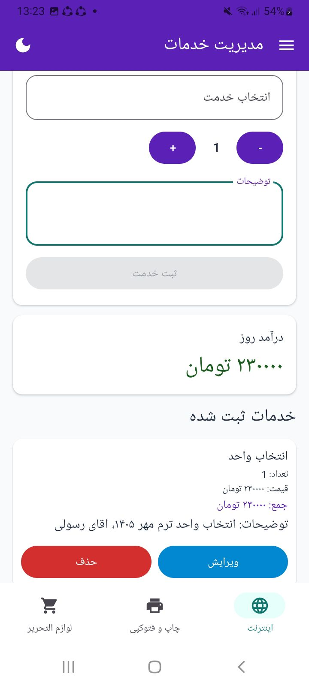
  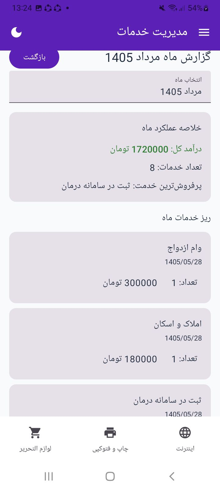

### 📅 انتخاب و مدیریت تاریخ

  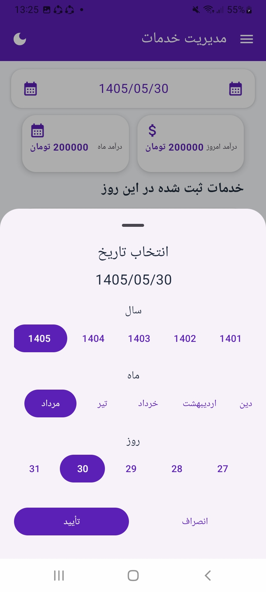

### ✏️ مدیریت خدمات

  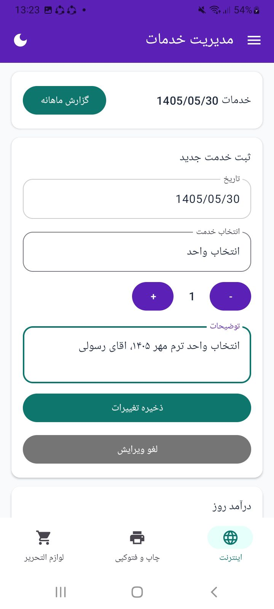
  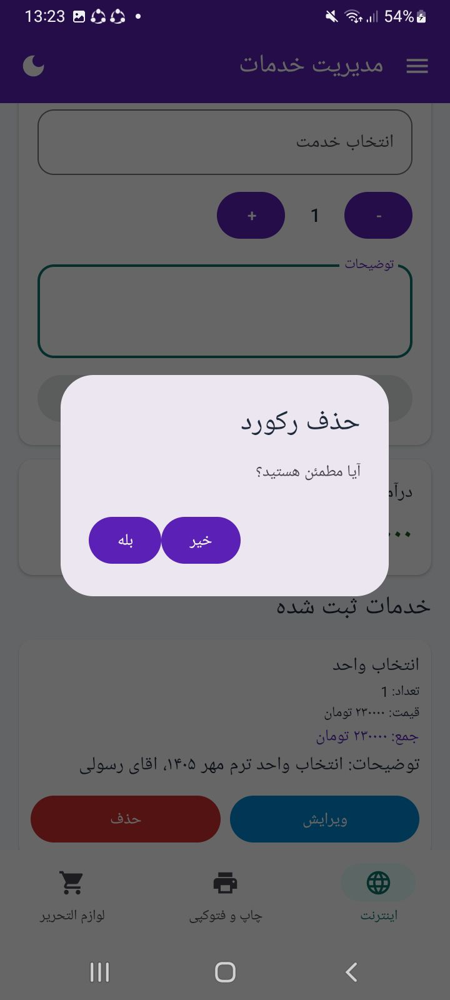

### 🌙 حالت تاریک

  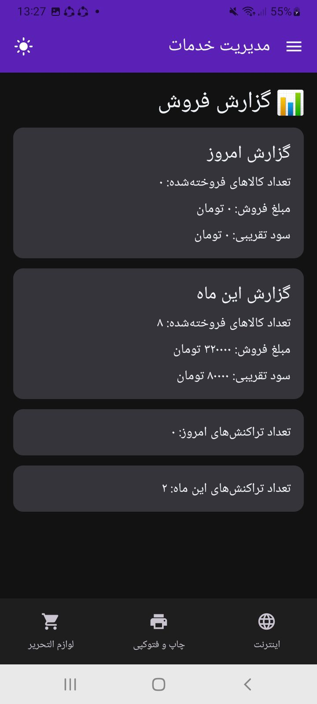
  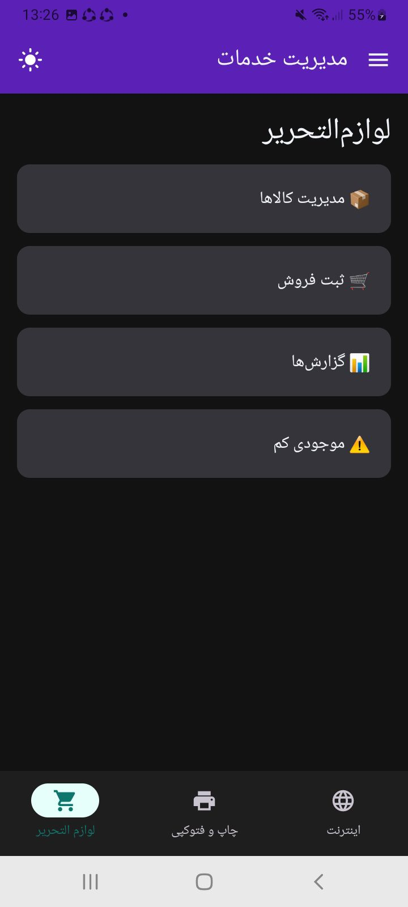
  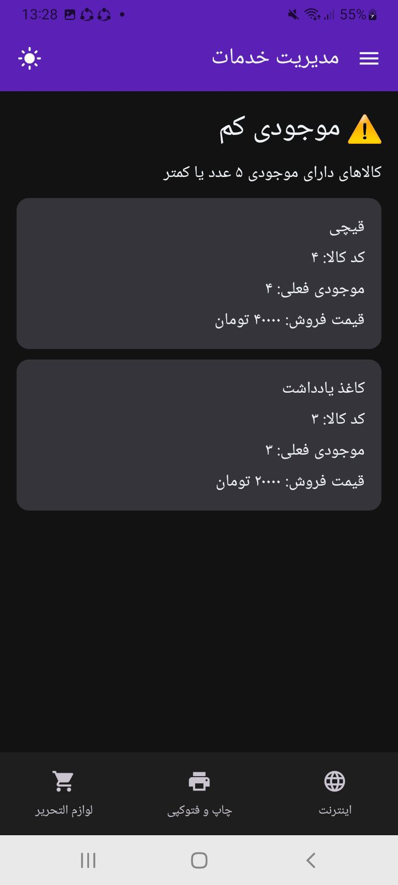

### ☀️ حالت روشن

  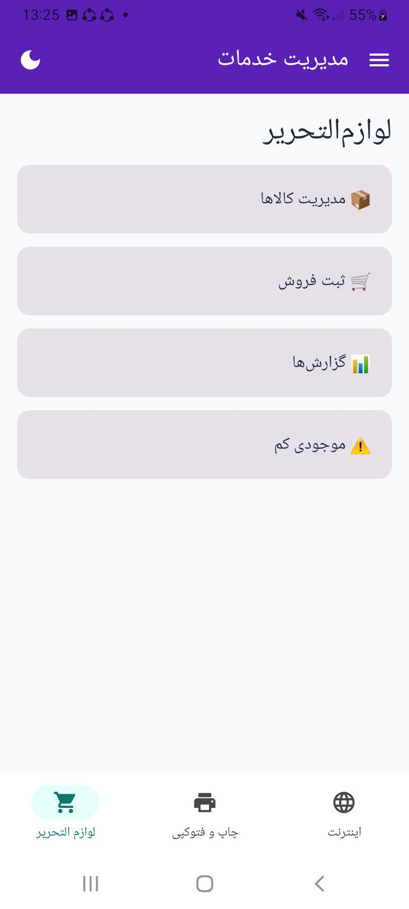
  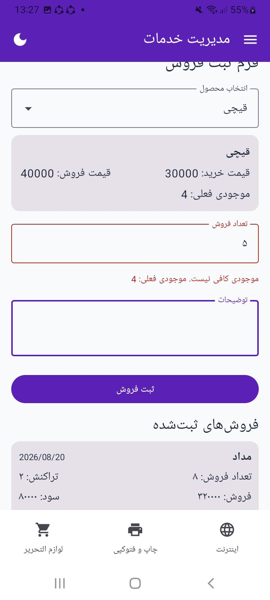

### 📦 مدیریت محصولات

  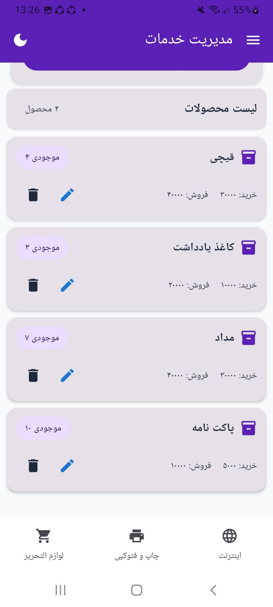

### 🛒 ثبت فروش

  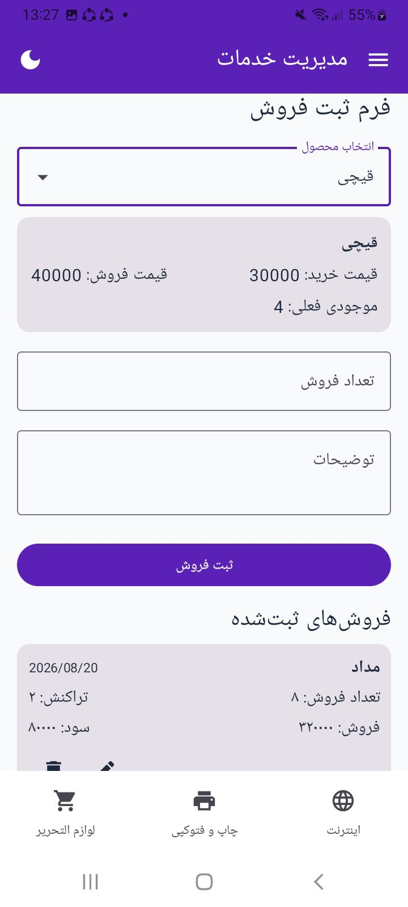

### 🖨️ بخش چاپ

  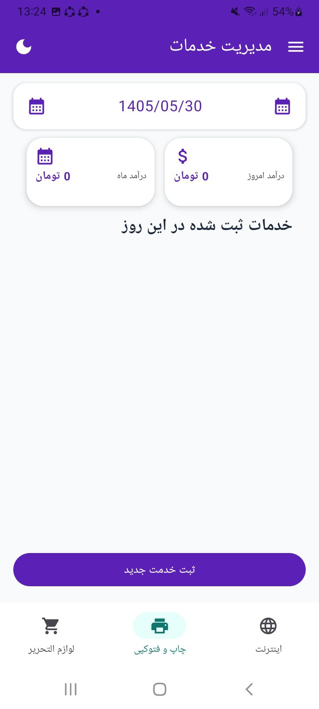

### 📱 سایر نماهای برنامه

  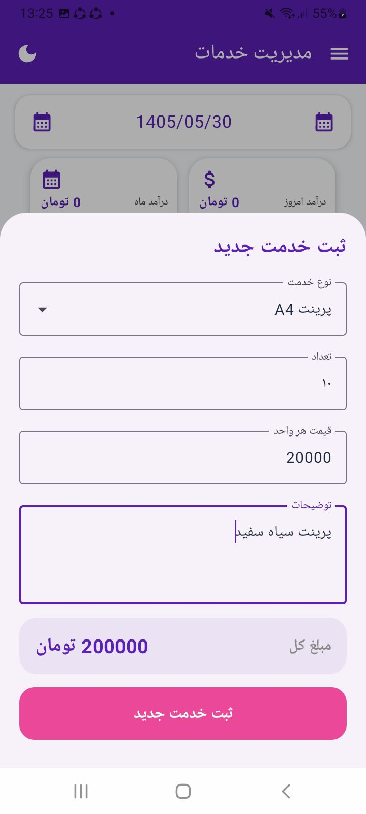
  
  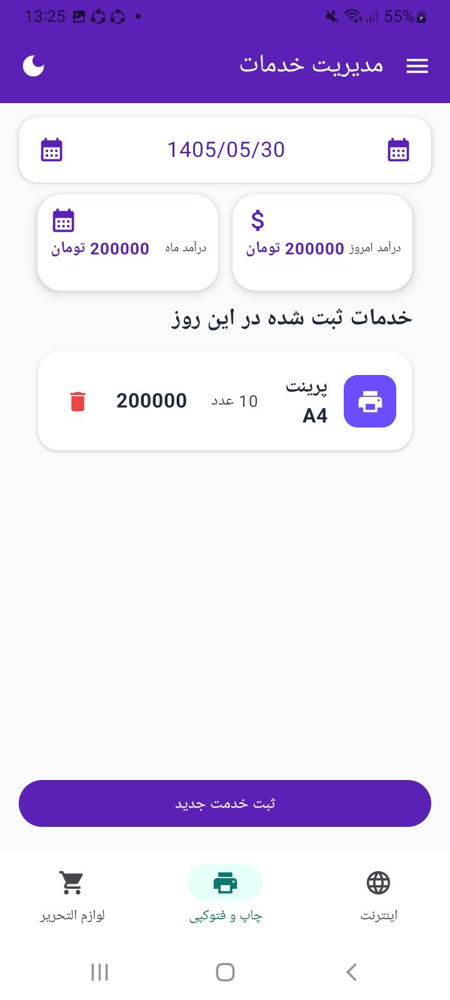
  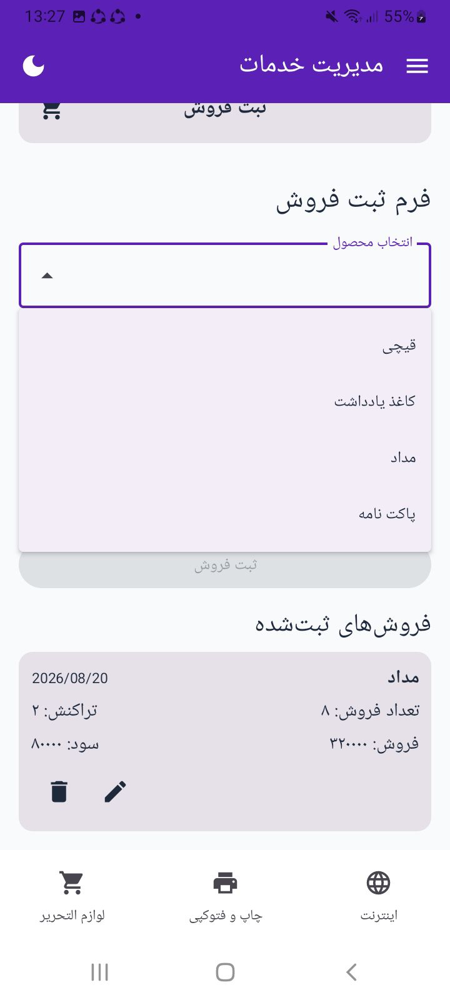

---

## 🎯 هدف پروژه

هدف همانگار صرفاً ساخت یک پروژه آموزشی نیست.

این پروژه با رویکرد ساخت یک نرم‌افزار واقعی برای کسب‌وکارهای کوچک توسعه داده شده است.

تمرکز پروژه روی موارد زیر است:

- ثبت اطلاعات واقعی
- ذخیره‌سازی دائمی اطلاعات
- مدیریت موجودی
- ثبت فروش
- محاسبه سود
- گزارش‌گیری
- رابط کاربری کاربردی
- معماری قابل توسعه
- استفاده از دیتابیس محلی

---

## 🚀 مسیر توسعه آینده

قابلیت‌های احتمالی نسخه‌های آینده:

- گزارش‌های پیشرفته‌تر
- گزارش فروش و سود در بازه دلخواه
- مدیریت هزینه‌ها
- مدیریت مشتریان
- بدهکار و بستانکار
- پشتیبان‌گیری از اطلاعات
- بازیابی اطلاعات
- خروجی Excel
- خروجی PDF
- نمودارهای فروش
- فیلترهای پیشرفته
- تعیین حد موجودی توسط کاربر
- توسعه خدمات برای صنف‌های مختلف
- شخصی‌سازی بیشتر برنامه

---

## 📱 وضعیت پروژه

همانگار در حال توسعه است و بخش‌های اصلی مربوط به:

- خدمات اینترنتی
- مدیریت کالا
- ثبت فروش
- مدیریت موجودی
- گزارش فروش
- گزارش ماهانه
- هشدار موجودی کم
- Light Mode
- Dark Mode

پیاده‌سازی شده‌اند.

هدف نهایی پروژه این است که از یک نرم‌افزار تخصصی برای یک کسب‌وکار خاص، به یک ابزار قابل استفاده برای کسب‌وکارهای کوچک و صنف‌های مختلف تبدیل شود.

---

## 👨‍💻 توسعه‌دهنده

**علیرضا حلوایی**

Android Developer

    Kotlin
    Jetpack Compose
    Room
    Hilt
    MVVM
    Clean Architecture

---

## ⭐ حمایت از پروژه

اگر پروژه همانگار برای شما جالب بود، می‌توانید Repository را Star کنید.